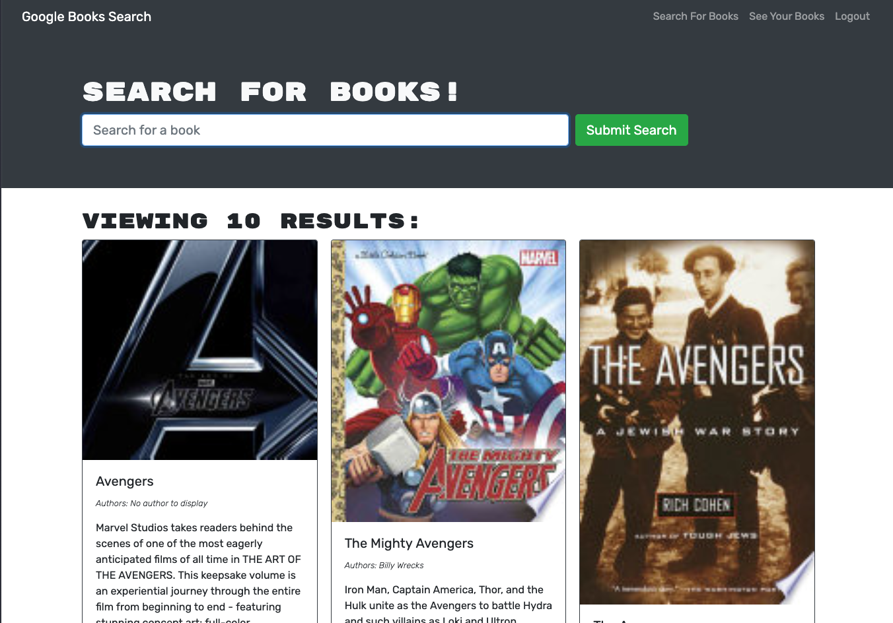
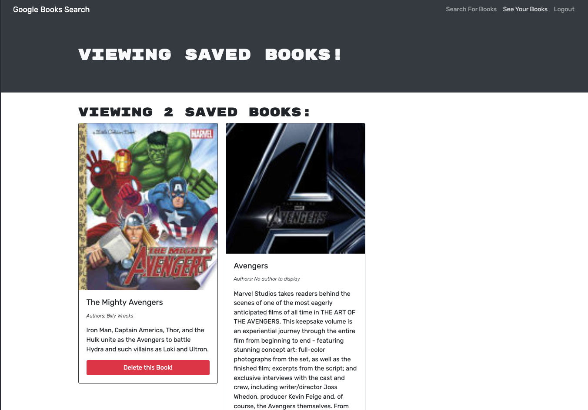

# Book Search Engine

Book Search Engine built with MERN stack.
This is a google book search engine. It will allow you to search for books in the Google Books API and return a list of books based on the search query.
After signing up, you can save your favorite books and view them in your profile. You can also delete your saved books.

## Table of Contents

- [Book Search Engine](#book-search-engine)
  - [Table of Contents](#table-of-contents)
  - [Click here to for a live demo.](#click-here-to-for-a-live-demo)
  - [Technologies Used](#technologies-used)
  - [Screenshots](#screenshots)
  - [Installation](#installation)
  - [Deployment](#deployment)
  - [Questions?](#questions)

## Click [here](https://stormy-bastion-88143.herokuapp.com) to for a live demo.

## Technologies Used

- [MongoDB](https://www.mongodb.com/)
- [Express](https://expressjs.com/)
- [React](https://reactjs.org/)
- [Node.js](https://nodejs.org/)
- [GraphQL](https://graphql.org/)
- [Heroku](https://www.heroku.com/)
- [Mern Stack](https://mern.io/)

## Screenshots





## Installation

```
git clone git@github.com:jimenezraul/BSE.git
cd BSE
npm install
npm run develop
```

## Deployment

Heroku deployment: [Live Demo](https://stormy-bastion-88143.herokuapp.com)

## Questions?

If you have any questions, please feel free to contact me at [jimenezraul1981@gmail.com](mailto:jimenezraul1981@gmail.com)
